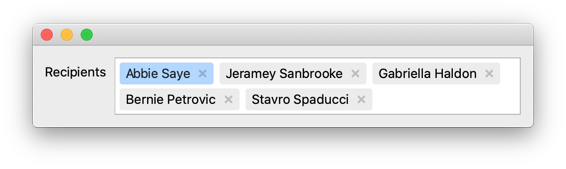
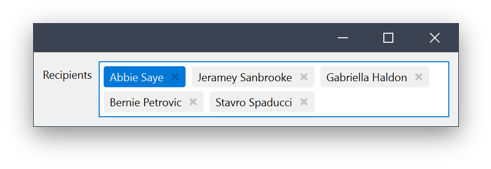
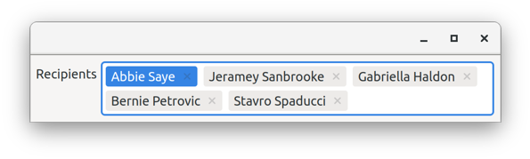

# Qt Token Edit

Implementation of a token edit based on the Qt model/view framework. 

## Requirements

* C++14 compliant compiler 
* Qt version >= 5.9 (a lower version may work but was not tested)

## Notable Features

### QAbstractItemModel Interface

The token edit is populated using the QAbstractItemModel interface. The widget reacts to changes from outside using the model’s signals.

### Usage of QStyle and QPalette

The implementation utilises the application’s style wherever possible. Colors are taken from the widget’s palette.

__MacOS__

[[full size]](images/styles/macos.png)

__Windows__

[[full size]](images/styles/windows_10.png)

__Gnome Adwaita__

[[full size]](images/styles/gnome_adwaita.png)

### Auto-Completion and validation

The token edit exposes its QLineEdit so that auto-completion and validation can easily be added as normally.

### Drag and Drop

Drag and Drop is implemented using the QAbstractItemModel interface. However only move operations are currently supported.

### High-DPI Support

The widget is properly scaled at different DPI scale factors.

### Optional Collapsed State

When the widget is not in focus, tokens that do not fit into the widget without scrolling can be collapsed into one displaying the number of collapsed ones.

### Option to Remove Tokens

The token edit offers an intuitive way to delete items through both mouse and keyboard interaction.

## Known Issues

- Only move operations are supported for drag and drop.
- The widget does not rescale when moving between windows with difference DPI scaling

## References

- Token fields in MacOS [[link]](https://developer.apple.com/design/human-interface-guidelines/macos/fields-and-labels/token-fields/)
- Input chips in Material Design [[link]](https://material.io/components/chips/#input-chips)
